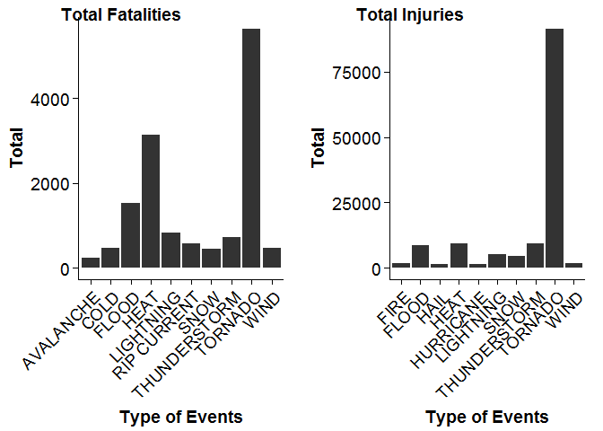
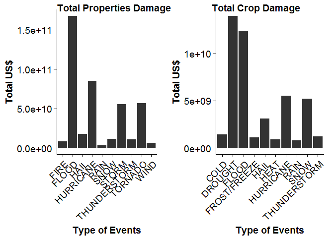

# Types of weather events are most harmful with respect to population health and greatest economic consequences
Reproducible Research - Peer Assessment 2

## Synopsis

This project involves the analysis of information from the US National Oceanic and Atmospheric Administration's (NOAA) storm database from 1950 to 2011.
This database contains the main characteristics of serious weather events in the United States.
This analysis is shown the worst severe wheather type in number of fatalities, injuries and economic consequences.

## Data Processing

### Load Libraries

```r
library(ggplot2)
library(dplyr)
```

```
## 
## Attaching package: 'dplyr'
## 
## The following object is masked from 'package:stats':
## 
##     filter
## 
## The following objects are masked from 'package:base':
## 
##     intersect, setdiff, setequal, union
```

```r
require(cowplot)
```

```
## Loading required package: cowplot
## 
## Attaching package: 'cowplot'
## 
## The following object is masked from 'package:ggplot2':
## 
##     ggsave
```

### Unzip and Load Data

```r
StormData <- read.csv(bzfile("Data/repdata-data-StormData.csv.bz2"))
```

### Clean and consolidate Type Data
The information in this data file are not consolidated and cleaned. For example, many types of weather are in upper case and others in lower case. Furthermore, many words are written in different manners.

```r
StormData$EVTYPE <- as.character(StormData$EVTYPE)
StormData$EVTYPE = toupper(StormData$EVTYPE)
StormData$EVTYPE[grepl("AVALANC", StormData$EVTYPE)] <- "AVALANCHE" 
StormData$EVTYPE[grepl("COLD", StormData$EVTYPE)] <- "COLD"  
StormData$EVTYPE[grepl("HYPOTHERMIA", StormData$EVTYPE)] <- "COLD"  
StormData$EVTYPE[grepl("FIRE", StormData$EVTYPE)] <- "FIRE"  
StormData$EVTYPE[grepl("FLOOD", StormData$EVTYPE)] <- "FLOOD"  
StormData$EVTYPE[grepl("HAIL", StormData$EVTYPE)] <- "HAIL"  
StormData$EVTYPE[grepl("HEAT", StormData$EVTYPE)] <- "HEAT" 
StormData$EVTYPE[grepl("HYPERTHERMIA", StormData$EVTYPE)] <- "HEAT" 
StormData$EVTYPE[grepl("HURRICAN", StormData$EVTYPE)] <- "HURRICANE"
StormData$EVTYPE[grepl("LIGHT", StormData$EVTYPE)] <- "LIGHTNING"  
StormData$EVTYPE[grepl("RAIN", StormData$EVTYPE)] <- "RAIN"  
StormData$EVTYPE[grepl("PRECIP", StormData$EVTYPE)] <- "RAIN"  
StormData$EVTYPE[grepl("RIP CURRENT", StormData$EVTYPE)] <- "RIP CURRENT"
StormData$EVTYPE[grepl("SNOW", StormData$EVTYPE)] <- "SNOW"  
StormData$EVTYPE[grepl("WINTER STORM", StormData$EVTYPE)] <- "SNOW"
StormData$EVTYPE[grepl("ICE STORM", StormData$EVTYPE)] <- "SNOW"
StormData$EVTYPE[grepl("STORM SURGE", StormData$EVTYPE)] <- "STORM"
StormData$EVTYPE[grepl("TROPICAL.*STORM", StormData$EVTYPE)] <- "STORM"  
StormData$EVTYPE[grepl("THUN.*ORM", StormData$EVTYPE)] <- "THUNDERSTORM"  
StormData$EVTYPE[grepl("TSTM", StormData$EVTYPE)] <- "THUNDERSTORM"  
StormData$EVTYPE[grepl("TORNAD", StormData$EVTYPE)] <- "TORNADO"  
StormData$EVTYPE[grepl("WIND", StormData$EVTYPE)] <- "WIND"  
StormData$EVTYPE <- as.factor(StormData$EVTYPE)
```

### Determining multiplier PROPDMG, CROPDMG

```r
StormData$PROPDMGEXP = toupper(StormData$PROPDMGEXP)
StormData$PROPDMGEXP <- as.factor(StormData$PROPDMGEXP)
StormData$CROPDMGEXP = toupper(StormData$CROPDMGEXP)
StormData$CROPDMGEXP <- as.factor(StormData$CROPDMGEXP)
unique(StormData$PROPDMGEXP)
```

```
##  [1] K M   B + 0 5 6 ? 4 2 3 H 7 - 1 8
## Levels:  - ? + 0 1 2 3 4 5 6 7 8 B H K M
```

```r
unique(StormData$CROPDMGEXP)
```

```
## [1]   M K B ? 0 2
## Levels:  ? 0 2 B K M
```

### Updating values of PROPDMG, CROPDMG

```r
StormData[StormData$PROPDMGEXP == "K", ]$PROPDMG <- StormData[StormData$PROPDMGEXP == "K", ]$PROPDMG * 1000
StormData[StormData$PROPDMGEXP == "M", ]$PROPDMG <- StormData[StormData$PROPDMGEXP == "M", ]$PROPDMG * 1e+06
StormData[StormData$PROPDMGEXP == "B", ]$PROPDMG <- StormData[StormData$PROPDMGEXP == "B", ]$PROPDMG * 1e+09
StormData[StormData$CROPDMGEXP == "K", ]$CROPDMG <- StormData[StormData$CROPDMGEXP == "K", ]$CROPDMG * 1000
StormData[StormData$CROPDMGEXP == "M", ]$CROPDMG <- StormData[StormData$CROPDMGEXP == "M", ]$CROPDMG * 1e+06
StormData[StormData$CROPDMGEXP == "B", ]$CROPDMG <- StormData[StormData$CROPDMGEXP == "B", ]$CROPDMG * 1e+09
```

### Selecting only the necessary data

```r
by_evtype <- StormData %>% select(EVTYPE, FATALITIES, INJURIES, PROPDMG, CROPDMG, CROPDMGEXP, PROPDMGEXP) %>% group_by (EVTYPE)
```


## Results

### Analysing which types of events are most harmful with respect to population health

Fatalities

```r
sum_fat <- head(by_evtype %>% summarize(SUM_FAT=sum(FATALITIES)) %>% arrange(desc(SUM_FAT)),10)
sum_fat
```

```
## Source: local data frame [10 x 2]
## 
##          EVTYPE SUM_FAT
## 1       TORNADO    5636
## 2          HEAT    3139
## 3         FLOOD    1525
## 4     LIGHTNING     818
## 5  THUNDERSTORM     725
## 6   RIP CURRENT     577
## 7          WIND     467
## 8          COLD     459
## 9          SNOW     454
## 10    AVALANCHE     225
```

Injuries

```r
sum_inj <- head(by_evtype %>% summarize(SUM_INJ=sum(INJURIES)) %>% arrange(desc(SUM_INJ)),10)
sum_inj
```

```
## Source: local data frame [10 x 2]
## 
##          EVTYPE SUM_INJ
## 1       TORNADO   91407
## 2  THUNDERSTORM    9447
## 3          HEAT    9224
## 4         FLOOD    8604
## 5     LIGHTNING    5234
## 6          SNOW    4504
## 7          WIND    1896
## 8          FIRE    1608
## 9          HAIL    1467
## 10    HURRICANE    1328
```

Comparing types of events

```r
plot_fat <- qplot(EVTYPE, data = sum_fat, weight = SUM_FAT, geom = "bar") + ylab("Total") + theme(axis.text.x = element_text(angle = 45, hjust = 1)) + xlab("Type of Events")
plot_inj <- qplot(EVTYPE, data = sum_inj, weight = SUM_INJ, geom = "bar") + ylab("Total") + theme(axis.text.x = element_text(angle = 45, hjust = 1)) + xlab("Type of Events")
plot_grid(plot_fat, plot_inj, align='h', labels=c('Total Fatalities', 'Total Injuries'))
```

 


### Analysing which types of events have the greatest economic consequences

Properties Damage

```r
sum_prop <- head(by_evtype %>% summarize(SUM_PROP=sum(PROPDMG)) %>% arrange(desc(SUM_PROP)),10)
sum_prop
```

```
## Source: local data frame [10 x 2]
## 
##          EVTYPE     SUM_PROP
## 1         FLOOD 167529740932
## 2     HURRICANE  84756180010
## 3       TORNADO  56993097979
## 4         STORM  55679114550
## 5          HAIL  17619991072
## 6          SNOW  11704396863
## 7  THUNDERSTORM  10930495954
## 8          FIRE   8501628500
## 9          WIND   6077098123
## 10         RAIN   3250564190
```

Crop Damage

```r
sum_crop <- head(by_evtype %>% summarize(SUM_CROP=sum(CROPDMG)) %>% arrange(desc(SUM_CROP)),10)
sum_crop
```

```
## Source: local data frame [10 x 2]
## 
##          EVTYPE    SUM_CROP
## 1       DROUGHT 13972566000
## 2         FLOOD 12380109100
## 3     HURRICANE  5515292800
## 4          SNOW  5189220600
## 5          HAIL  3114212873
## 6          COLD  1416765550
## 7  THUNDERSTORM  1206848738
## 8  FROST/FREEZE  1094186000
## 9          HEAT   904469280
## 10         RAIN   806162800
```

Comparing types of events

```r
plot_prop <- qplot(EVTYPE, data = sum_prop, weight = SUM_PROP, geom = "bar") + ylab("Total US$") + theme(axis.text.x = element_text(angle = 45, hjust = 1)) + xlab("Type of Events")
plot_crop <- qplot(EVTYPE, data = sum_crop, weight = SUM_CROP, geom = "bar") + ylab("Total US$") + theme(axis.text.x = element_text(angle = 45, hjust = 1)) + xlab("Type of Events")
plot_grid(plot_prop, plot_crop, align='h', labels=c('Total Properties Damage', 'Total Crop Damage'))
```

 
